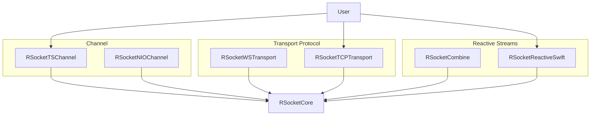

# RSocket Swift
RSocket Swift is a Client and Server implementation of the RSocket  (**R**eactive **Socket**) network protocol on top of SwiftNIO. It's an **alpha** version and still under active development.
**Do not use it in a production environment!**

## What is RSocket?
RSocket provides a protocol for Reactive Streams semantics between client-server, and server-server communication. It is a binary protocol for use on byte stream transports such as TCP, WebSockets, and Aeron.
Key Features:
* support for interaction models beyond request/response such as streaming responses and push
* application-level flow control semantics (async pull/push of bounded batch sizes) across network boundaries
* binary, multiplexed use of a single connection
* support resumption of long-lived subscriptions across transport connections

More Information about RSocket can be found at [rsocket.io](https://rsocket.io/) and a great presentation from @OlegDokuka is available on [YouTube](https://www.youtube.com/watch?v=KapSjhUYSz4). 

### Modules
The implementation is split into multiple modules. This allows a user of this package to only include what is really needed.

`RSocketCore`, as the name implies, contains the core logic which every other module depends on.
The other modules are grouped in one of three categories:

* **Channel** - convenience client bootstrap implementation which configures a SwiftNIO Channel Pipeline and takes care of TLS/SSL, EventLoopGroup creation and shutdown. Either `RSocketTSChannel` which uses swift-nio-transport-services (i.e. Network.framework) or `RSocketNIOChannel` which uses `swift-nio-ssl` for TLS/SSL and the default channel implementation for a TCP connection.

* **Transport Protocol** - RSocket can run on top of any message-stream oriented transport protocol. `RSocketWSTransport` contains channel handlers which allow RSocket to run over WebSocket. `RSocketTCPTransport` is the equivalent for a plain TCP connection.

* **Reactive Streams** - RSocket Swift lets you choose which implementation of Reactive Streams you want to use. ReactiveSwift is implemented, Combine and [async/await/AsyncSequence](https://github.com/rsocket/rsocket-swift/pull/44) are work in progress. You can also mix two reactive stream libraries and do some requests with Combine and some with async/await over the same connection.

A User will usually only chose one from each category. 

## Current State
All [Mandatory Core Protocol Features](https://rsocket.io/docs/implementations) have been implemented and tested against the Java and Kotlin implementation.
Working examples can be found under [Sources/Examples](https://github.com/rsocket/rsocket-swift/tree/main/Sources/Examples). [TimerClient](https://github.com/rsocket/rsocket-swift/blob/main/Sources/Examples/TimerClient/main.swift) and [TwitterClient](https://github.com/rsocket/rsocket-swift/blob/main/Sources/Examples/TwitterClient/main.swift) connect to [demo.rsocket.io/rsocket](http://demo.rsocket.io/) where a [Kotlin Server is running](https://github.com/rsocket/rsocket-demo/tree/master/src/main/kotlin/io/rsocket/demo/) and work without running a server locally.
The Client API has currently a lot more convenience API's and is a lot simpler than the Server API. If you want to create an RSocket Server you need to create you own SwiftNIO pipeline and setup SSL/TLS yourself. This will be improved in the future as we implement [some RSocket extensions](https://github.com/rsocket/rsocket/tree/master/Extensions) like [Routing](https://github.com/rsocket/rsocket/blob/master/Extensions/Routing.md).

### Transport
- [x] WebSocket
- [x] TCP

### Reactive Streams
- [ ] [async/await & AsyncSeqence](https://github.com/rsocket/rsocket-swift/pull/44)
- [ ] Combine
- [x] ReactiveSwift
- [ ] RxSwift

## What is planned
* Automatic reconnect for Clients
* [RSocket extensions](https://github.com/rsocket/rsocket/tree/master/Extensions) including [Composite Metadata](https://github.com/rsocket/rsocket/blob/master/Extensions/CompositeMetadata.md), [Routing](https://github.com/rsocket/rsocket/blob/master/Extensions/Routing.md) and [per Stream Data MIME Types](https://github.com/rsocket/rsocket/blob/master/Extensions/PerStreamDataMimeTypesDefinition.md)
* Autogenerated Documentation
* Server Examples
* Combine and async/await & AsyncSeqence
